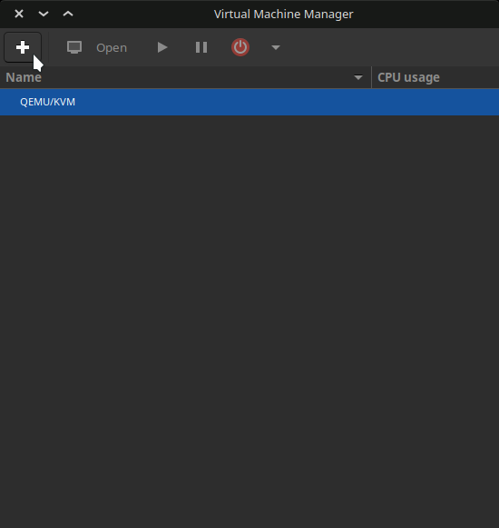
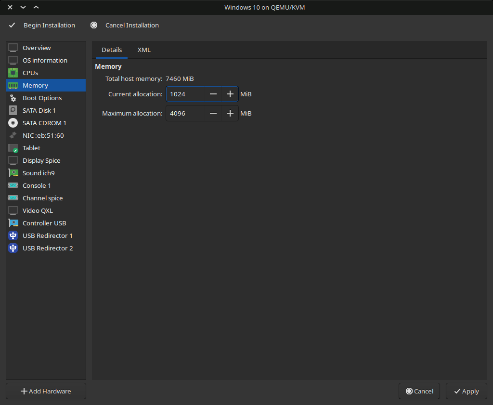
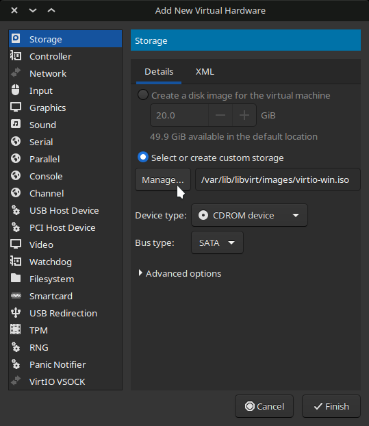
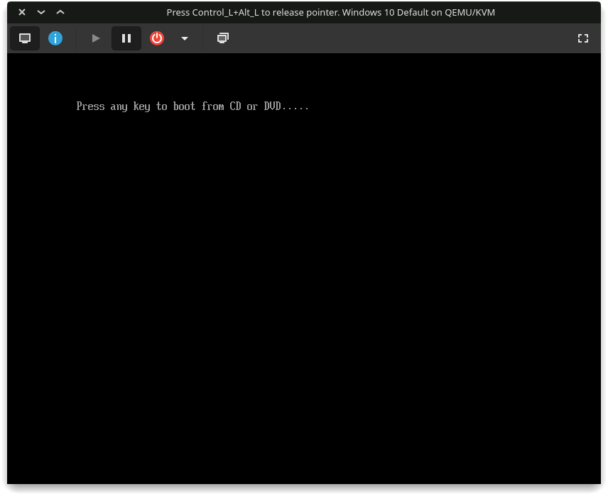
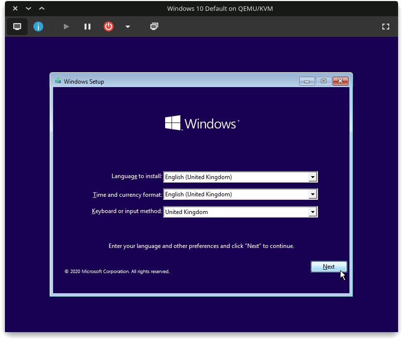
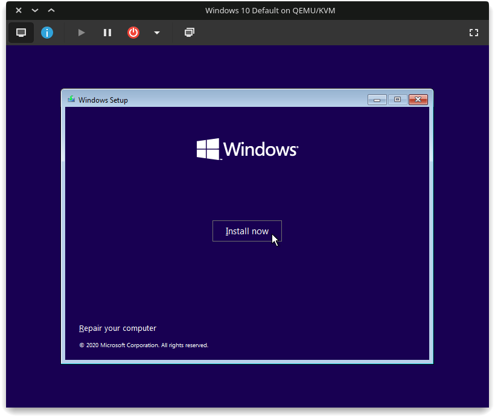

# 🛸 DIY From Scratch - WIP

If you want to go through the process of making a VM all by yourself, this section is for you.

This guide works regardless of your distribution.

## Enabling Virtualization in your UEFI/Coreboot

You need to enable **AMD-V** or Intel **VT-x/VT-d** depending on your CPU brand in your UEFI before going further.

On Coreboot devices, 

<p>
<details>
<summary>AMD - MSI Tomahawk</summary>
<br>

- Boot in to Bios using "Delete" Key

- Select "Overclocking"

- Go to "OC Explore Mode" and turn that to "Expert"

- Scroll down to "CPU Features"

- Select "SVM Mode" and "Enable"

- Save and Exit
</br>
</details>
</p>

### Install the required packages on your system. You may search the packages in your package manager or compile them yourself.

<p>
<details>
<summary>Installing Dependencies</summary>
<br>

### Install Qemu-KVM, Virt-Manager, Libvirt and other dependencies on your distro.

**Note:** Any Linux distribution will work just fine. You do need to install `libvirt`, `virt-manager`, `qemu`, and other required dependencies.

 ```bash
# Debian & Ubuntu (Linux Mint, PopOS, ElementaryOS)
sudo apt install -y qemu qemu-kvm libvirt-bin libvirt-daemon libvirt-clients bridge-utils virt-manager
``` 

 ```bash
# Fedora based ditros  
sudo dnf -y install qemu-kvm libvirt bridge-utils virt-install virt-manager
``` 

```bash
# Arch (Manjaro, Arco Linux, EndeavourOS) 
sudo pacman -S --noconfirm qemu libvirt bridge-utils edk2-ovmf vde2 ebtables dnsmasq openbsd-netcat virt-manager
 ```

### After installing the dependencies, make sure you enable the following services.

Instead of `Systemd`, you can use `OpenRC`, `Runit`, `SysVinit` as well.

```bash
 # Enable Libvirt Service
 sudo systemctl enable --now libvirtd

 # Enable VM Console logging 
 sudo systemctl enable --now virtlogd 

 # Enable Virtual Network Bridge 
 sudo virsh net-autostart default
 sudo virsh net-start default
 ```
</br> 
</details>
</p>

> **Linux Kernel 5.4 LTS** or newer is recommended
 

## Downloading ISOs

If you want to run Anti-Cheat games and use Winapps, you will need **Windows 10 Pro/Pro N/Pro Workstation/Enterprise**, as they have Hyper-V Support which is required.
 
- Download [Windows 10 Pro ISO](https://www.microsoft.com/en-us/software-download/windows10ISO), and [VirtIO Drivers (Stable)](https://fedorapeople.org/groups/virt/virtio-win/direct-downloads/stable-virtio/virtio-win.iso)

> You may even supply your own custom Windows Image (like Windows Ameliorated Edition)

**Note:** Place ISOs in `/var/lib/libvirt/images/` to avoid permission issues.

## Creating a VM

<p>
<details>
<summary>Step by Step Guide - Click Me!</summary>
<br>

+ Open Virt Manager from your applications menu or type `virt-manager` in terminal.

+ Click on the ➕ icon or the first icon in Virt Manager to create a VM.




+ Select the Windows 10 ISO that you downloaded earlier, and choose the OS from the list if it isn't detected automatically.


+ Allocate Memory and CPUs as per requirement.


+ Either create a new disk or create one as big as you want, and later select the disk here.
You can enter any directory you wish, as well as how big you want it to be.

+ Enter this command to create a disk.
`qemu-img create -f qcow2 /var/lib/libvirt/images/Windows10Vanilla.qcow2 1024G`


+ Check `Customize configuration before install` and click **Finish**.


+ In the Overview section, Select `OVMF_CODE.fd` in Firmware.


+ In the CPU section, check `Copy host CPU configuration` if you aren't planning to make a Stealth VM, and `host-passthrough` otherwise.

+ You may manually set `CPU Topology` if you know the exact layout of your CPU.

>for example: **Ryzen 5 3600** has `6 Cores`, `12 Threads` and is only available in `1 Socket` motherboards.


+ In the Memory section, enter `Current allocation = 1024` to make initial RAM usage less.



+ In SATA Disk section, Change the `Disk Bus` to `VirtIO` to make operations faster by reducing overhead.


+ In NIC section, Change the `Device model` to `VirtIO` to enable Virtual Network Bridge for interfacing between VM and Host.


+ Click **Add Hardware** and select the Storage section to add VirtIO Drivers ISO and change the `Device type` to `CDROM device` and click Finish.




+ In the Boot Options section, select Windows ISO CDROM and VirtIO Disk that we created earlier, and check 'Enable boot menu'.

+ Finally, Click `Begin Installation` to save and start the VM.


+ Click inside the VM Window and press any key when asked.  




+ Select your language and keyboard input and click Next.





+ Enter your product key now, or you can skip and enter your product key after installation.


+ Selecting **Windows 10 Pro N** will install **Windows 10 Pro** without extra bloat.
> Note: Choose Windows 10 Pro XXX or Enterprise if you need Hyper-V for Stealth VM. 


+ Select **Custom Install**  (because the other one is useless)


+ Click on **Load Driver** to install disk drivers.


+ Double-Click on **CD Drive virtio-win** ➜ **amd64** ➜ **w10** and click **OK**. 


+ Just click N**ext** to select the default one.


+ Select `Unallocated Space` and click **Next** to begin the installation.


+ After installation, Windows will boot normally and you will need to set up your user account and password.

+ Avoid Microsoft Sign in if you can at all 😉 

</br>
</details>
</p>


## GPU Passthrough 

Ideally you need to have 2 GPUs (one dedicated and one integrated) in order to access Windows as well as Linux desktop simultaneously, by using 2 monitors or switching the display output on one monitor.

However, if you are living in the world after 2020, I know your pain and why you have only one (or possibly none) GPU.

You might be in one of the following situations:

  1. You ONLY have one GPU, either discrete GPU (NVIDIA/AMD) or integrated Graphics (Intel UHD/AMD Radeon)
  2. You have a discrete GPU (NVIDIA/AMD) + integrated Graphics (Intel UHD/AMD Radeon)
  3. You have two discrete GPUs (then integrated graphics won't matter)

If you are one of the privileged people to own a GPU, and are looking to pass it through without integrated graphics, check out these Single GPU Passthrough Guides:
  1. [SomeOrdinaryGamers' Single GPU Passhrough Video (NVIDIA)](https://youtube.com/watch?v=BUSrdUoedTo)
  2. [joeknock90](https://github.com/joeknock90/Single-GPU-Passthrough)

If you are lucky enough to have 2 discrete GPUs, you can reserve one GPU for your Linux system and pass the other one to Windows. Check these guides out:

  1. [Level1Tech's GPU Passthrough Guide](https://www.youtube.com/watch?v=aLeWg11ZBn0)
  2. [SomeOrdinaryGamers' KVM Guide](https://www.youtube.com/watch?v=h7SG7ccjn-g)

If you only have integrated graphics right now, check out:

- [Intel GPU Passhrough](https://lantian.pub/en/article/modify-computer/laptop-intel-nvidia-optimus-passthrough.lantian/)

If you want to be able to use Hardware Accelerated Applications (like Video Games, Adobe CC, etc) on a Windows VM without dedicating an entire monitor to Windows VM, check out the **Looking Glass** Project:

  - [Looking Glass](https://looking-glass.io) - An extremely low latency Memory-to-Memory frame copy from the Guest to Host.
  - [Level1Techs Video](https://www.youtube.com/watch?v=okMGtwfiXMo) - It has gotten better than what this video demonstrates!

NVIDIA's driver **465** and newer support GPU Passthrough to a Windows Guest on a Linux Host.

>NOTE: NVIDIA still doesn't support SR-IOV so you will need an iGPU or a separate GPU if you want to be able to access the Linux Host.
>
>If you don't want to use a second GPU, check out [Single GPU Passthrough](https://github.com/joeknock90/Single-GPU-Passthrough) by [joeknock90](https://github.com/joeknock90/)

So if you need to passthrough an NVIDIA or AMD GPU without making it obvious that you are using a VM, add the following lines to your XML.

1. List all VMs
```bash
sudo virsh list --all
```


2. Edit the VM config
```bash
sudo virsh edit Windows10
```

3. Enter the following text between the already existing sections. You can replace `randomid` with `AuthenticAMD` to fix a few issues on AMD GPUs.
```bash
...
<features>
...
  <hyperv>
  ...
    <vendor_id state="on" value="randomid"> 

  </hyperv>
...
</features>
```


## AMD Reset Bug Fixes

- For Polaris, Vega and Gen1 Navi Reset fix, installing [vendor-reset](https://github.com/gnif/vendor-reset) is enough thanks to [gnif](https://github.com/gnif).
- [Navi Reset Bug Kernel V2](https://forum.level1techs.com/t/navi-reset-bug-kernel-patch-v2/163103/14)
- [Pop! OS 20.10 VFIO 5700XT](https://forum.level1techs.com/t/pop-os-20-10-vfio-5700xt-pain/169647/2)

## Making your VM Stealth

### 🔖 [Guide on Stealthy VM](stealth-vm.md)
