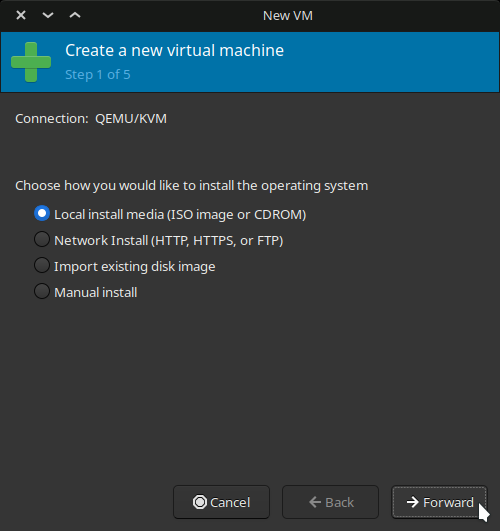
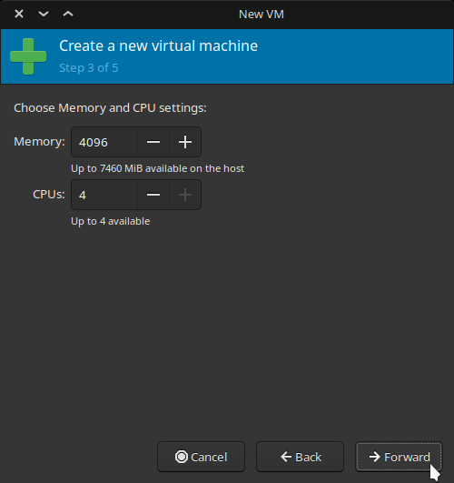
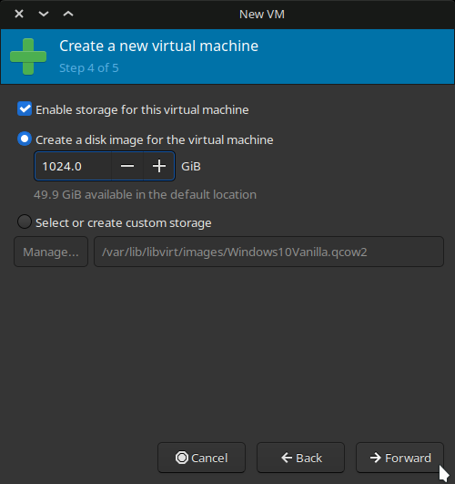
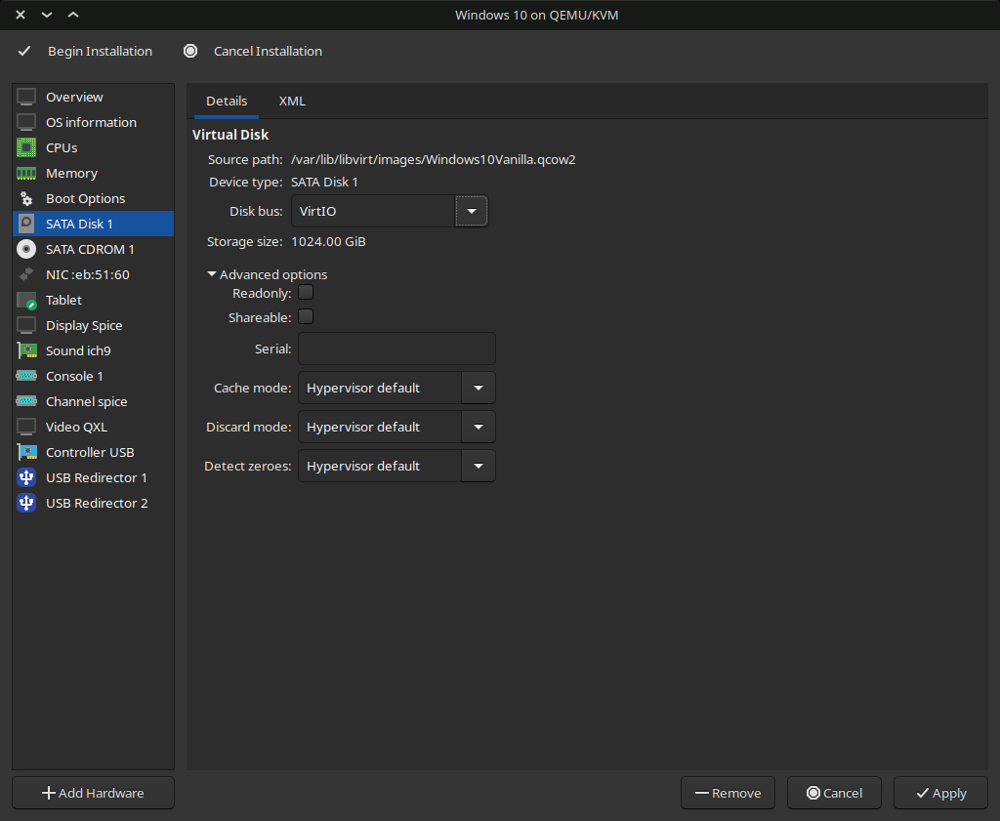
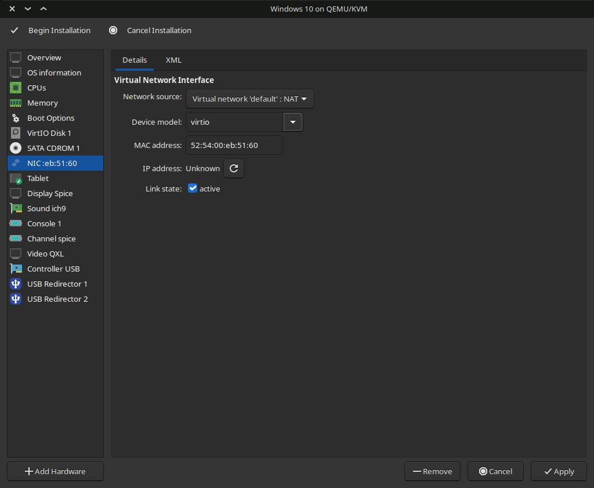

## 🛸 DIY (From Scratch) - WIP

### First, you must install the required packages on your system. You may search the packages in your package manager or compile them yourself.

<p>
<details>
<summary>Installing Dependencies</summary>
<br>

### Install Qemu-KVM, Virt-Manager, Libvirt and other dependencies on your distro.

**Note:** Any Linux distribution will work just fine. You do need to install `libvirt`, `virt-manager`, `qemu`, and other required dependencies.

 ```bash
# Debian & Ubuntu (Linux Mint, PopOS, ElementaryOS)
sudo apt install -y qemu qemu-kvm libvirt-bin libvirt-daemon libvirt-clients bridge-utils virt-manager
``` 

 ```bash
# Fedora based ditros  
sudo dnf -y install qemu-kvm libvirt bridge-utils virt-install virt-manager
``` 

```bash
# Arch (Manjaro, Arco Linux, EndeavourOS) 
sudo pacman -S --noconfirm qemu libvirt bridge-utils edk2-ovmf vde2 ebtables dnsmasq openbsd-netcat virt-manager
 ```

### After installing the dependencies, make sure you enable the following services.

Instead of `Systemd`, you can use `OpenRC`, `Runit`, `SysVinit` as well.

```bash
 # Enable Libvirt Service
 sudo systemctl enable --now libvirtd

 # Enable VM Console logging 
 sudo systemctl enable --now virtlogd 

 # Enable Virtual Network Bridge 
 sudo virsh net-autostart default
 sudo virsh net-start default
 ```
</br> 
</details>
</p>

> **Linux Kernel 5.4 LTS** or newer is recommended
 
## Download the Windows 10 ISO and KVM VirtIO drivers

You will need **Windows 10 Pro/Pro N/Pro Workstation/Enterprise**, as they have Hyper-V Support which is needed if you want to run Anti-Cheat games and use Winapps.
 
1. Download [Windows 10 Pro ISO](https://www.microsoft.com/en-us/software-download/windows10ISO), and [VirtIO Drivers (Stable)](https://fedorapeople.org/groups/virt/virtio-win/direct-downloads/stable-virtio/virtio-win.iso)

> You may even supply your own custom Windows Image (like Windows Ameliorated Edition)

**Note:** Place ISOs in `/var/lib/libvirt/images/` to avoid permission issues.

## Creating a VM

<p>
<details>
<summary>Step by Step Guide - Click Me!</summary>
<br>

+ Click on the ➕ icon or the first icon in Virt Manager to create a VM.




+ Select the Windows 10 ISO that you downloaded earlier, and choose the OS from the list if it isn't detected automatically.


+ Allocate Memory and CPUs as per requirement.



+ Either create a new disk or create one as big as you want, and later select the disk here.
You can enter any directory you wish, as well as how big you want it to be.

+ Enter this command to create a disk.
`qemu-img create -f qcow2 /var/lib/libvirt/images/Windows10Vanilla.qcow2 1024G`



+ Check `Customize configuration before install` and click **Finish**.


+ In the Overview section, Select `OVMF_CODE.fd` in Firmware.


+ In the CPU section, check `Copy host CPU configuration` if you aren't planning to make a Stealth VM, and `host-passthrough` otherwise.

+ You may manually set `CPU Topology` if you know the exact layout of your CPU.

>for example: **Ryzen 5 3600** has `6 Cores`, `12 Threads` and is only available in `1 Socket` motherboards.


+ In the Memory section, enter `Current allocation = 1024` to make initial RAM usage less.


+ In SATA Disk section, Change the `Disk Bus` to `VirtIO` to make operations faster by reducing overhead.



+ In NIC section, Change the `Device model` to `VirtIO` to enable Virtual Network Bridge for interfacing between VM and Host.



+ Click **Add Hardware** and select the Storage section to add VirtIO Drivers ISO and change the `Device type` to `CDROM device` and click Finish.


+ In the Boot Options section, select Windows ISO CDROM and VirtIO Disk that we created earlier, and check 'Enable boot menu'.

+ Finally, Click `Begin Installation` to save and start the VM.


+ Click inside the VM Window and press any key when asked.  


+ Select your language and keyboard input and click Next.


+ Enter your product key now, or you can skip and enter your product key after installation.


+ Selecting **Windows 10 Pro N** will install **Windows 10 Pro** without extra bloat.
> Note: Choose Windows 10 Pro XXX or Enterprise if you need Hyper-V for Stealth VM. 


+ Select **Custom Install**  (because the other one is useless)


+ Click on **Load Driver** to install disk drivers.


+ Double-Click on **CD Drive virtio-win** ➜ **amd64** ➜ **w10** and click **OK**. 


+ Just click N**ext** to select the default one.


+ Select `Unallocated Space` and click **Next** to begin the installation.


</br>
</details>
</p>
