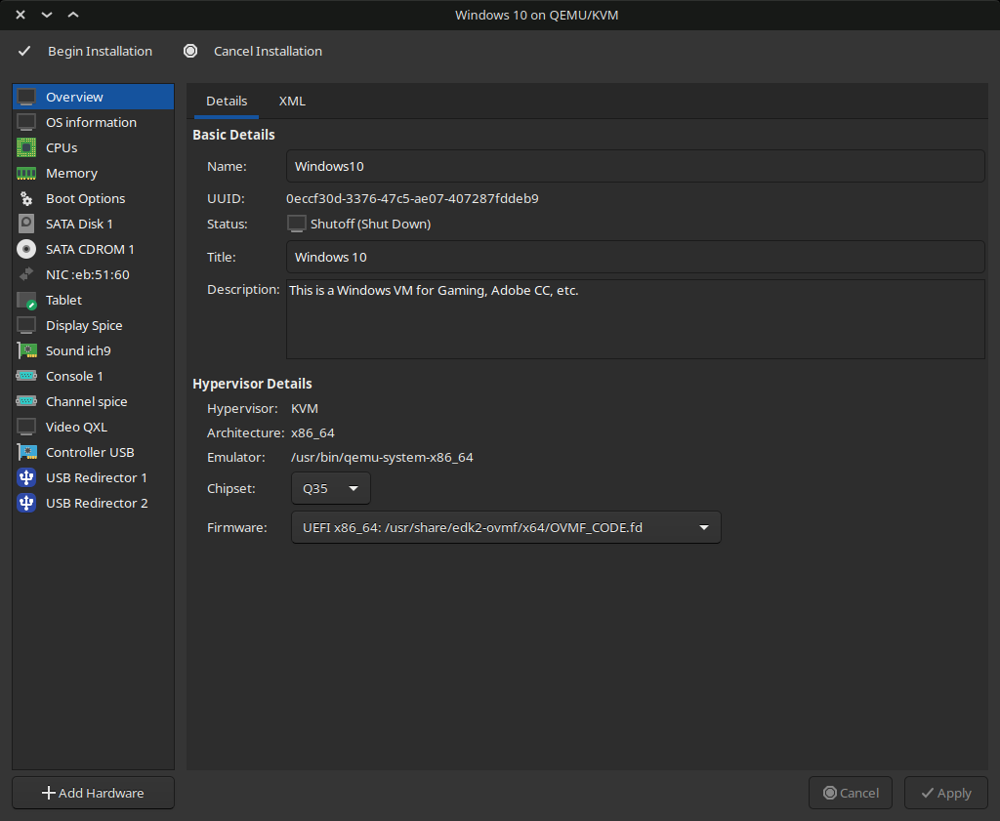
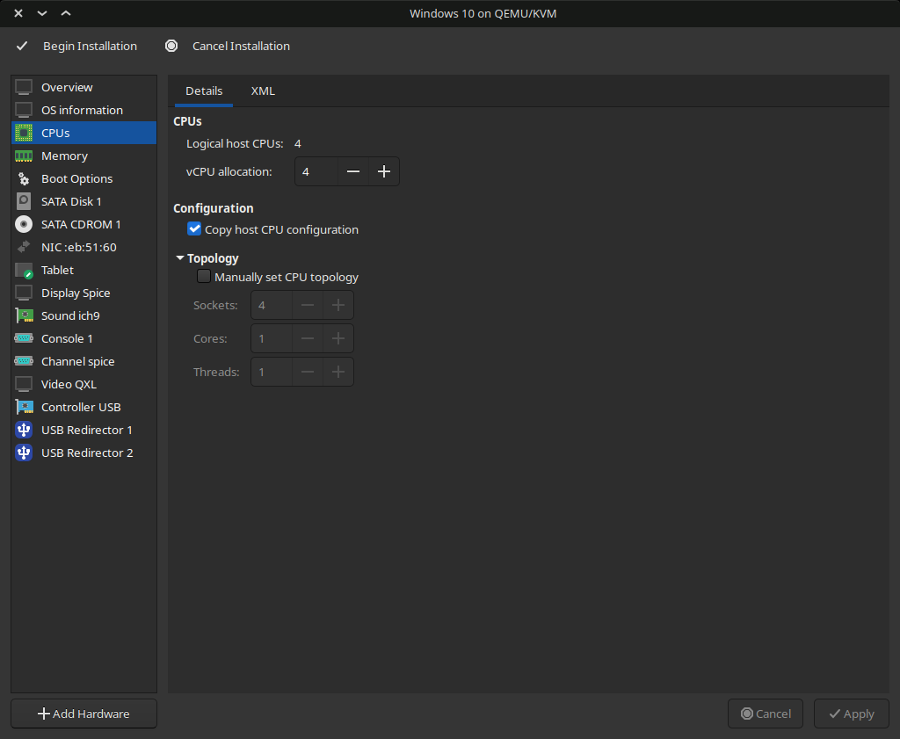

## 🛸 DIY (From Scratch) - WIP

### First, you must install the required packages on your system. You may search the packages in your package manager or compile them yourself.

<p>
<details>
<summary>Installing Dependencies</summary>
<br>

### Install Qemu-KVM, Virt-Manager, Libvirt and other dependencies on your distro.

**Note:** Any Linux distribution will work just fine. You do need to install `libvirt`, `virt-manager`, `qemu`, and other required dependencies.

 ```bash
# Debian & Ubuntu (Linux Mint, PopOS, ElementaryOS)
sudo apt install -y qemu qemu-kvm libvirt-bin libvirt-daemon libvirt-clients bridge-utils virt-manager
``` 

 ```bash
# Fedora based ditros  
sudo dnf -y install qemu-kvm libvirt bridge-utils virt-install virt-manager
``` 

```bash
# Arch (Manjaro, Arco Linux, EndeavourOS) 
sudo pacman -S --noconfirm qemu libvirt bridge-utils edk2-ovmf vde2 ebtables dnsmasq openbsd-netcat virt-manager
 ```

### After installing the dependencies, make sure you enable the following services.

Instead of `Systemd`, you can use `OpenRC`, `Runit`, `SysVinit` as well.

```bash
 # Enable Libvirt Service
 sudo systemctl enable --now libvirtd

 # Enable VM Console logging 
 sudo systemctl enable --now virtlogd 

 # Enable Virtual Network Bridge 
 sudo virsh net-autostart default
 sudo virsh net-start default
 ```
</br> 
</details>
</p>

> **Linux Kernel 5.4 LTS** or newer is recommended
 
## Download the Windows 10 ISO and KVM VirtIO drivers

You will need **Windows 10 Pro/Pro N/Pro Workstation/Enterprise**, as they have Hyper-V Support which is needed if you want to run Anti-Cheat games and use Winapps.
 
1. Download [Windows 10 Pro ISO](https://www.microsoft.com/en-us/software-download/windows10ISO), and [VirtIO Drivers (Stable)](https://fedorapeople.org/groups/virt/virtio-win/direct-downloads/stable-virtio/virtio-win.iso)

> You may even supply your own custom Windows Image (like Windows Ameliorated Edition)

**Note:** Place the ISOs in `/var/lib/libvirt/images/` to avoid permission issues.

## Create Virtual Drive

To create a virtual disk, enter the following in your terminal. Instead of `1024G` can select any amount of storage depending on your needs. 

```bash
qemu-img create -f qcow2 /var/lib/libvirt/images/Windows10Vanilla.qcow2 1024G
```

## Creating a VM

<p>
<details>
<summary>Step by Step Guide - Click Me!</summary>
<br>






</br>
</details>
</p>
