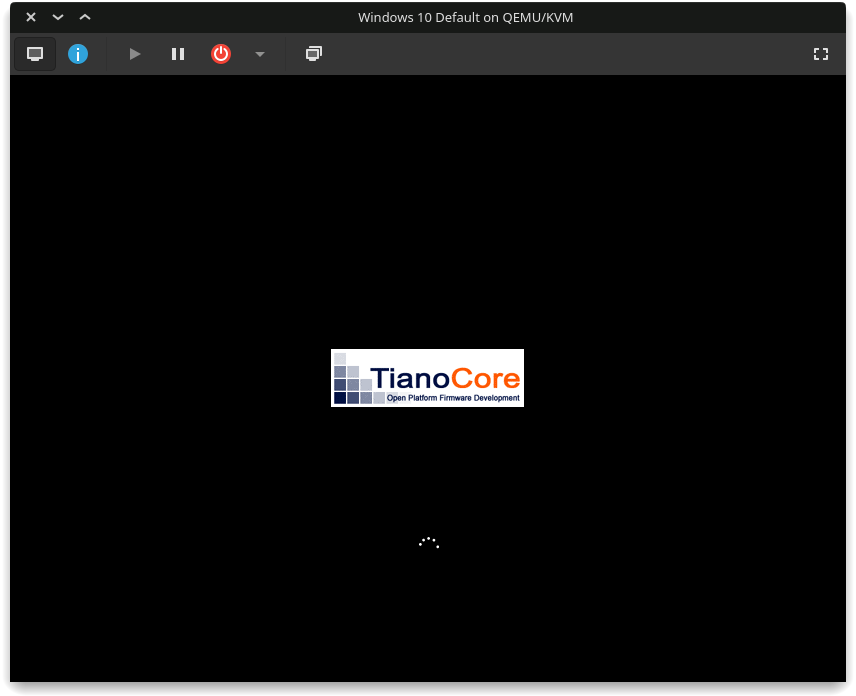
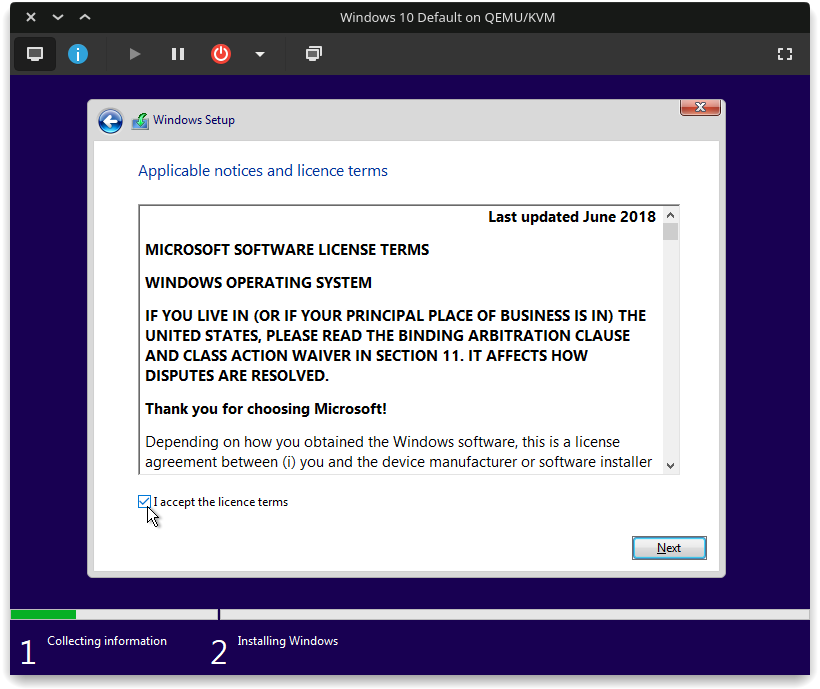
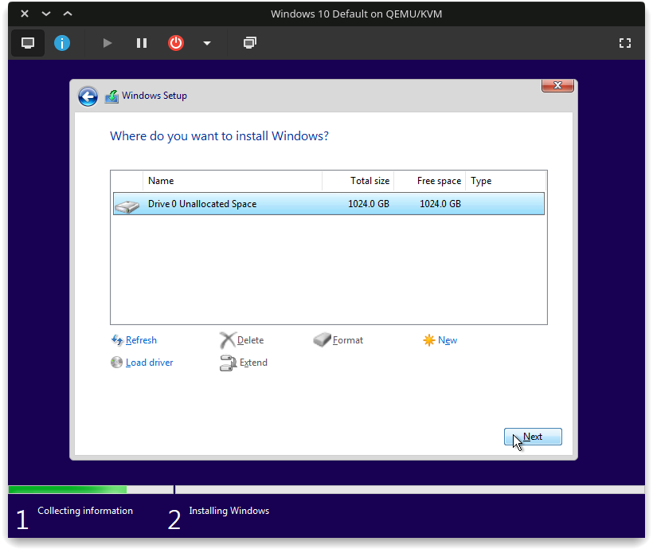

# 🗔 Installing Windows on a VM

### Please follow along the steps below to get the VM ready.

+ Open **Virtual Machine Manager** and Start the **Windows VM**

> If you encounter an OVMF/edk2 problem, check out [OVMF Fix](https://wiki.archlinux.org/index.php/PCI_passthrough_via_OVMF#Cannot_boot_after_upgrading_ovmf)
>
> **Or you can enter the following command in terminal (only applicable this VM)**
>
> Ubuntu/Debian ➜ `sudo cp /usr/share/OVMF/OVMF_CODE.fd /var/lib/libvirt/qemu/nvram/Windows10-default_VARS.fd `
>
> Fedora ➜ `sudo cp /usr/share/edk2/ovmf/OVMF_CODE.fd /var/lib/libvirt/qemu/nvram/Windows10-default_VARS.fd`
>
> Arch ➜ `sudo cp /usr/share/ovmf/x64/OVMF_VARS.fd /var/lib/libvirt/qemu/nvram/Windows10-default_VARS.fd`

+ Click inside the VM Window and press any key when asked.  

+ Select your language and keyboard input and click Next.

+ Enter your product key now, or you can skip and enter your product key after installation.

+ Selecting **Windows 10 Pro N** will install **Windows 10 Pro** without extra bloat.
> Note: Choose Windows 10 Pro XXX or Enterprise if you need Hyper-V for Stealth VM. 

+ Select **Custom Install**  (because the other one is useless)

+ Click on **Load Driver** to install disk drivers.

+ Double-Click on **CD Drive virtio-win** ➜ **amd64** ➜ **w10** and click **OK**. 

+ Just click N**ext** to select the default one.

+ Select `Unallocated Space` and click **Next** to begin the installation.

### 🎉 That's it, You have successfully installed Windows!
