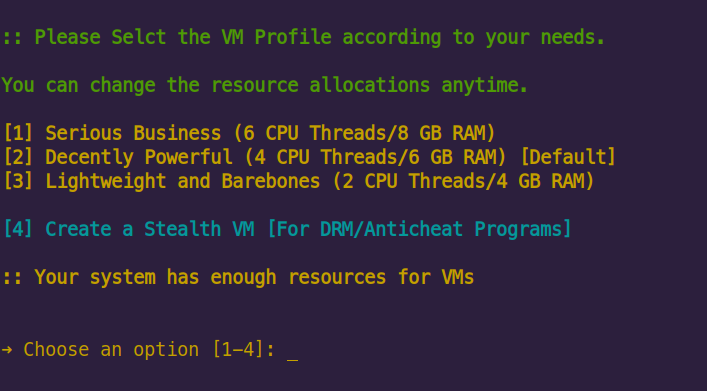
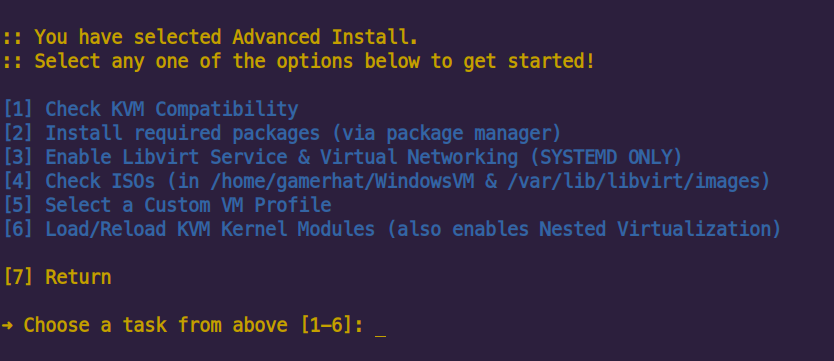
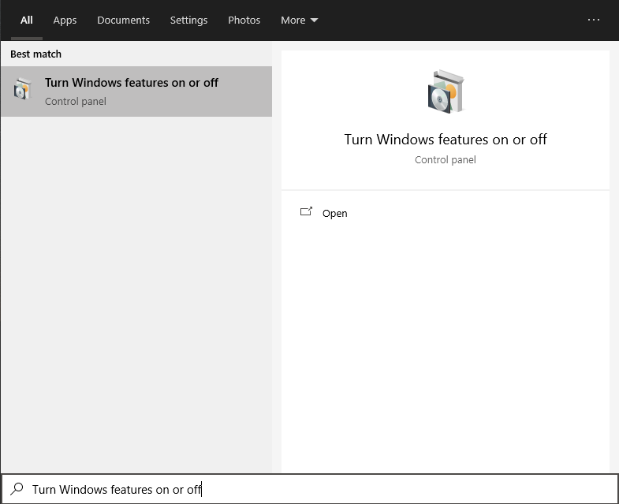

# 🛡 Making a Stealth VM

If you need to mask your VM from checks that a few programs do to restrict users from using certain programs inside a VM for various reasons (like Video Games), then this section is for you.

## ⚠️ Things to keep in mind

1. Windows 10 Home is not supported as it DOES NOT have Hyper-V feature unlike Pro and Enterprise.
2. It is recommended to not install VirtIO Display drivers if you are going to passthrough a GPU (onboard/dedicated).
3. We are fooling Apps and Softwares, and not Windows itself, as that would be way more hectic, unreliable, and at the end of the not ideal.
4. You might notice some performance degradation in the Stealth VM
5. Having a separate installation of Windows apart from normal Windows VM is encouraged.
6. Sometimes running a kernel older than the recent Windows Update might cause a bootloop of the VM. So either only enable security updates ([use this](https://github.com/thegamerhat/win-debloat))

## 🚀 Getting Started
- Select `Advanced Setup` and go to `Select a Custom VM Profile`
- From there, select `Create a Stealth VM`, and you will have a Stealthy VM ready (almost) in a few seconds.

| Select the Stealth Profile |
| --- |
|  |

- In `Advanced Setup` select `Load/Reload KVM Kernel Modules` to enable Nested Virtualization.

| Modprobe - Enable Nested Virtualization |
| --- |
|  |

- Start **Windows 10 Stealth** VM (Reboot if it doesn't start and do the previous step again)

- It should boot like normal Windows. Once you are past the Windows Install, go to **Turn Windows Features On or Off**.

| Search for Windows Features menu |
| --- |
|  |

- Click the ▼ dropdown menu for **Hyper-V**, and check both of the boxes as shown below.

| Enable Hyper-V |
| --- |
|  |

- After enabling **Hyper-V**, select the restart option from the prompt shown in Windows.

  > It is necessary to restart using Windows' built in method.
> If you face a bootloop in Windows, try switching to the latest kernel available to you.

> I have personally tested it on 5.10 LTS without any problems, but your mileage may vary.

> DO NOT USE `vendor-reset-dkms` if you have a newer AMD GPU.
