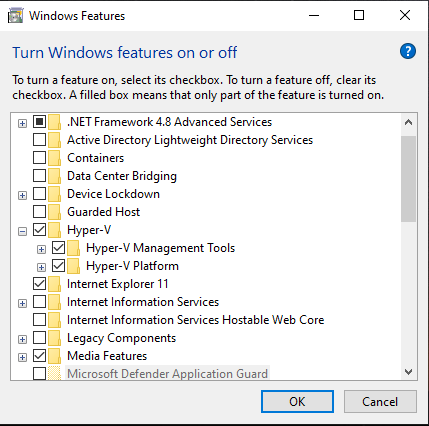

# 🛡 Making a VM Stealt

If you need to mask your VM from checks that a few programs do to restrict users from using certain programs inside a VM for various reasons (like Video Games), then this section is for you.

> It is recommended to not install VirtIO drivers if you are going to passthrough a GPU (onboard/dedicated).

- Select `Advanced Setup` and go to `Select a Custom VM Profile`
- From there, select `Create a Stealth VM`, and you will have a Stealthy VM ready (almost) in a few seconds.

| Select the Stealth Profile |
| --- |
|  |

- In `Advanced Setup` select `Load/Reload KVM Kernel Modules` to enable Nested Virtualization.

| Modprobe - Enable Nested Virtualization |
| --- |
|  |

- Start **Windows 10 Stealth** VM (Reboot if it doesn't start and do the previous step again)

- It should boot like normal Windows. Once you are past the Windows Install, go to **Turn Windows Features On or Off**.

| Search for Windows Features menu |
| --- |
|  |

- Click the ▼ dropdown menu for **Hyper-V**, and check both of the boxes as shown below.

| Enable Hyper-V |
| --- |
|  |

- After enabling **Hyper-V**, select the restart option from the prompt shown in Windows.

  > It is necessary to restart using Windows' built in method.
> If you face a bootloop in Windows, try switching to a different kernel (v5.10 LTS or v5.11).

> I have personally tested it on 5.10 LTS without any problems, but your mileage ma vary.

-
